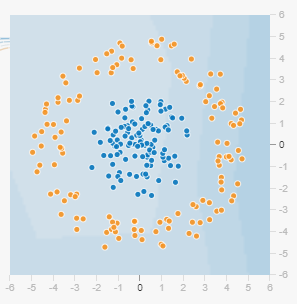
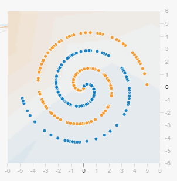
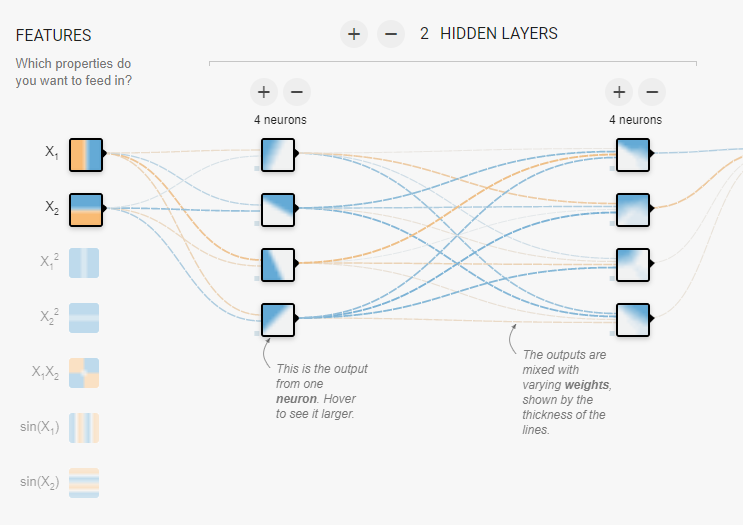

## Deep Neural Network - Tutorial

### Task 0: 基础知识

Deep Neural Network (DNN, 深度神经网络)的基本模型被称作Multi-Layer Perceptron (MLP, 多层感知机)；随后也将该模型称为Artificial Neural Network (ANN, 人工神经网络). ANN在使用过程中，其层数不断增加，直观看来产生更大的“深度”，深度神经网络因此得名。使用DNN进行学习的过程称为Deep Learning (DL, 深度学习)。

具体的理论知识不在此赘述，但关键的问题包括：

- 神经网络的前向传播如何实现？ 
- 神经网络常用的激活函数有哪些？它们发挥了什么作用？
- 神经网路的训练过程如何完成？

这里给出一些论文，能够覆盖上述问题；同时网络上也有丰富的资料对上述问题进行了细致地解答，请务必查阅。

> David E. Rumelhart; James L. McClelland, "Learning Internal Representations by Error Propagation," in Parallel Distributed Processing: Explorations in the Microstructure of Cognition: Foundations , MIT Press, 1987, pp.318-362.
>
> Rumelhart, D., Hinton, G. & Williams, R. Learning representations by back-propagating errors. *Nature* 323, 533–536 (1986). https://doi.org/10.1038/323533a0
>
> Han, J., Moraga, C. (1995). The influence of the sigmoid function parameters on the speed of backpropagation learning. In: Mira, J., Sandoval, F. (eds) From Natural to Artificial Neural Computation. IWANN 1995. Lecture Notes in Computer Science, vol 930. Springer, Berlin, Heidelberg. https://doi.org/10.1007/3-540-59497-3_175

同时，如果理解上述内容所需的基础知识有所欠缺，这里给出一个索引表，供参考：

**数学知识：**

- 微积分的基本知识，如多元函数求导，多元函数极值问题，凸函数的性质，泰勒公式等；
- 线性代数的基本知识，如什么是矩阵，矩阵的基本运算规则；矩阵转置和逆；矩阵的求导等；
- 概率论的基本知识，如什么是概率分布；什么是概率密度函数；贝叶斯公式是什么；什么是矩估计和极大似然估计。

 **参考资料：**

- 华东师范大学数学系.数学分析（上册）（第三版）[M].北京:高等教育出版社,2001:335
- 华中科技大学数学与统计学院.线性代数（第四版）[M].北京:高等教育出版社,2019:？
- 陈家鼎 郑忠国.概率与统计（第二版）（概率论分册）[M].北京.北京大学出版社,2017:312

**模型知识：**

- 机器学习的经典模型，了解其假设、公式推导、适用条件、效果，试着参考一些代码；

**参考资料：**

- 周志华.机器学习[M].北京:清华大学出版社,2016:425
- **[推荐！] Cornell CS4780 Lecture Notes: http://www.cs.cornell.edu/courses/cs4780/2018fa/page18/**

### Task 1: DNN图示化感知

这里我们通过一个图示化界面来辅助对DNN的理解。打开网页 http://playground.tensorflow.org/ 你可以看到一个可视化的全连接神经网络界面。请你自由探索这个可视化界面的使用方法，随后根据下列指引，回答问题。

只选取$x_1$与$x_2$两个线性特征，调整网络结构为2层网络，每层4个节点。使用默认数据集，如下图：

回答如下问题：

- 为什么神经网络中要使用非线性函数作为激活函数？调整网页Activation部分的选项，比较Linear与Sigmoid之间的区别；结合这种区别以及上述基础知识，说明这个问题。
- 使用线性激活函数Linear，将神经网络左侧的输入特征由$x_1$与$x_2$修改为只使用平方特征$x_1^2$与$x_2^2$，与第一问中的Linear训练结果作比较；请问两次训练结果不同的原因是什么？
- 将输入特征切换回$x_1$与$x_2$，分别用Sigmoid和ReLU做训练，问：两次训练有何区别？产生这种区别的原因是什么？

回答完上述问题后，请你通过左侧控制栏切换到最复杂的数据集：

此时你可以调整所有参数，来让神经网络在这个数据集上取得良好的分类效果。记录你的心得体会。

### HW2：反向传播算法

HW1中提到了一个使用Sigmoid函数实现的，每层有4个节点，共2层的神经网络，为便于描述，我们做形式化定义。

设左侧FEATURES为输入$\mathbb x$，两层网络进入激活函数前的权重矩阵为$w^{(1)}$和$w^{(2)}$，为了方便起见，不考虑偏置项$b$.

则在本例中：
$$
\mathbb x = [x_1 \space x_2] \\
w^{(1)} =
\left[
\begin{array}{l}
	w^{(1)}_{11} & w^{(1)}_{12} & w^{(1)}_{13} & w^{(1)}_{14} \\
	w^{(1)}_{21} & w^{(1)}_{22} & w^{(1)}_{23} & w^{(1)}_{24}
\end{array}
\right] \\
$$
则经计算，可以有：
$$
z^{(1)} = w^{(1)}x \\
a^{(1)} = \sigma(z^{(1)})
$$
由此得到第一层的输出$a^{(1)}$. 以此类推可以得到第二层的输出，即$y = a^{(2)}$，也是神经网络的最终输出。

本题要求：

- 请你根据所学知识，写出两个权重矩阵的更新式；如果在你的描述过程中需要表示激活函数，书写时请直接用$\sigma$代替。
- 不改变网络层数，但允许调整每层的神经元数量，请你在MNIST数据集上用NumPy实现这个全连接网络的训练过程。你可以根据你的喜好使用随机梯度下降或Batch Normalization，并根据你在HW1中的体验，选择你认为合适的激活函数。注意，这个过程不允许使用现有的深度学习库，要求自己实现公式推导和编程过程。

