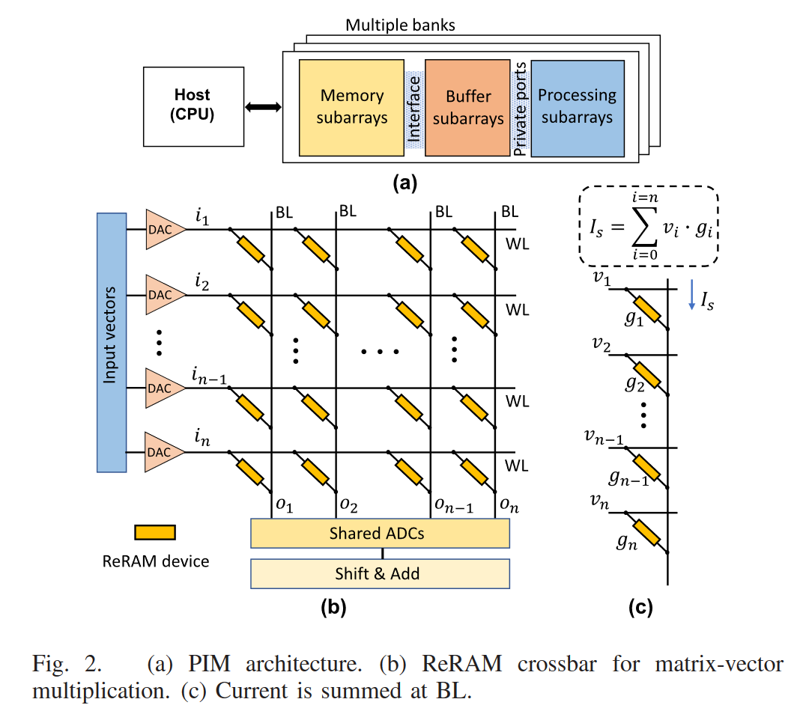

### NN

#### 高度并行

现在让我们把注意力转向神经网络，看看为什么GPU在深度学习中被如此频繁地使用。我们刚刚看到，GPU非常适合并行计算，而关于GPU的这个事实就是为什么深度学习要使用它们。神经网络是高度并行的（embarrassingly parallel）。

在并行计算中，高度并行任务是指将整个任务分割成一组较小的任务以并行计算的任务。 高度并行任务是那些很容易看到一组小任务彼此独立的任务。

由于这个原因，神经网络高度并行。我们用神经网络做的许多计算都可以很容易地分解成更小的计算，这样小的计算集就不会相互依赖。一个这样的例子就是卷积。

#### 卷积示例

来看一个卷积运算的例子：

这个动画展示了没有数字的卷积过程。我们在底部有一个蓝色的输入通道。在输入通道上滑动的底部有一个阴影的卷积滤波器，还有一个绿色的输出通道。 - 蓝色（底部）- 输入通道 - 阴影（覆盖在蓝色上）- 3*3的卷积过滤器 - 绿色（顶部）- 输出通道

对于蓝色输入通道上的每个位置，3x3过滤器进行计算，将蓝色输入通道的阴影部分映射到绿色输出通道的相应阴影部分。

在动画中，这些计算一个接一个地依次进行。但是，**每个计算都是独立于其他计算的，这意味着任何计算都不依赖于任何其他计算的结果。**

因此，所有这些独立的计算都可以在GPU上并行进行，从而产生整个输出通道。

这让我们看到，卷积运算可以通过使用并行编程方法和GPU来加速。

### GPU

#### GPU 和 CUDA

Nvidia GPU是支持并行计算的硬件，而CUDA是为开发者提供API的软件层。开发人员通过下载CUDA工具包来使用CUDA。随工具包而来的是专门的库，如cuDNN, CUDA深度神经网络库。

一开始，使用gpu加速的主要任务是计算机图形。因此得名图形处理单元，但近年来，出现了更多种类的并行任务。我们所看到的任务之一就是深度学习。深度学习和许多其他使用并行编程技术的科学计算任务一起，正在导致一种新的编程模型，称为GPGPU或通用GPU计算。

> GPGPU计算通常被称为GPU计算或加速计算，现在在GPU上预置各种任务变得越来越普遍。

英伟达是这一领域的先驱。Nvidia将通用GPU计算简称为GPU计算。英伟达首席执行官黄延森(Jensen Huang)很早就预见到了GPU计算，这也是CUDA在近10年前诞生的原因。

虽然CUDA已经存在了很长一段时间，但它现在才刚刚开始真正的飞行，而Nvidia在CUDA上的工作到目前为止是Nvidia在GPU计算深度学习方面领先的原因。

当我们听到Jensen谈到GPU计算堆栈时，他指的是底层的GPU是硬件，底层的CUDA是软件架构，最后是CUDA之上的cuDNN库。

这个GPU计算栈支持通用的计算能力，而通用的计算能力在其他方面是非常专业的。我们经常在计算机科学中看到这样的栈，因为技术是分层构建的，就像神经网络一样。

在CUDA和cuDNN之上的是PyTorch，这是很多人正在使用的最终支持应用程序的框架。

#### GPU 和 CPU

CPU和GPU之所以大不相同，是由于其设计目标的不同，它们分别针对了两种不同的应用场景。CPU需要很强的通用性来处理各种不同的数据类型，同时又要逻辑判断又会引入大量的分支跳转和中断的处理。这些都使得CPU的内部结构异常复杂。而GPU面对的则是类型高度统一的、相互无依赖的大规模数据和不需要被打断的纯净的计算环境。

于是CPU和GPU就呈现出非常不同的架构（示意图）：

CPUI与GPU架构

图片来自nVidia CUDA文档。其中绿色的是计算单元，橙红色的是存储单元，橙黄色的是控制单元。

GPU采用了数量众多的计算单元和超长的流水线，但只有非常简单的控制逻辑并省去了Cache。而CPU不仅被Cache占据了大量空间，而且还有有复杂的控制逻辑和诸多优化电路，相比之下计算能力只是CPU很小的一部分。

从上图可以看出： Cache, local memory： CPU > GPU

Threads(线程数): GPU > CPU

Registers: GPU > CPU

多寄存器可以支持非常多的Thread,thread需要用到register,thread数目大，register也必须得跟着很大才行。

SIMD Unit(单指令多数据流,以同步方式，在同一时间内执行同一条指令): GPU > CPU。

CPU 基于低延时的设计：

CPU有强大的ALU（算术运算单元）,它可以在很少的时钟周期内完成算术计算。

当今的CPU可以达到64bit 双精度。执行双精度浮点源算的加法和乘法只需要1～3个时钟周期。

CPU的时钟周期的频率是非常高的，达到1.532～3gigahertz(千兆HZ, 10的9次方)。

大的缓存也可以降低延时。保存很多的数据放在缓存里面，当需要访问的这些数据，只要在之前访问过的，如今直接在缓存里面取即可。

复杂的逻辑控制单元。当程序含有多个分支的时候，它通过提供分支预测的能力来降低延时。

数据转发。 当一些指令依赖前面的指令结果时，数据转发的逻辑控制单元决定这些指令在pipeline中的位置并且尽可能快的转发一个指令的结果给后续的指令。这些动作需要很多的对比电路单元和转发电路单元。

GPU是基于大的吞吐量设计。

GPU的特点是有很多的ALU和很少的cache. 缓存的目的不是保存后面需要访问的数据的，这点和CPU不同，而是为thread提高服务的。如果有很多线程需要访问同一个相同的数据，缓存会合并这些访问，然后再去访问dram（因为需要访问的数据保存在dram中而不是cache里面），获取数据后cache会转发这个数据给对应的线程，这个时候是数据转发的角色。但是由于需要访问dram，自然会带来延时的问题。

GPU的控制单元（左边黄色区域块）可以把多个的访问合并成少的访问。

GPU的虽然有dram延时，却有非常多的ALU和非常多的thread. 为啦平衡内存延时的问题，我们可以中充分利用多的ALU的特性达到一个非常大的吞吐量的效果。尽可能多的分配多的Threads.通常来看GPU ALU会有非常重的pipeline就是因为这样。

所以**CPU擅长逻辑控制，串行的运算。和通用类型数据运算不同，GPU擅长的是大规模并行计算，这也正是密码破解等所需要的。所以GPU除了图像处理，也越来越多的参与到计算当中来**。

#### GPU 和 NN

**深度学习和神经网络的每个计算任务都是独立于其他计算的**，任何计算都不依赖于任何其他计算的结果，可以采用高度并行的方式进行计算。而GPU相比于CPU拥有更多独立的大吞吐量计算通道，较少的控制单元使其不会受到计算以外的更多任务的干扰，拥有比CPU更纯粹的计算环境，所以深度学习和神经网络模型在GPU的加持下会更高效地完成计算任务。

### PIM

#### 背景

在冯诺依曼体系中，cpu计算和memory存储是分离的，而两者之间的data movement会造成高延迟和高耗能。

而随着近年AI等访存密集和计算密集应用的发展，高延迟和高耗能的问题成为急需解决的问题。

Nvidia的Chief Scientist——Bill Dally在2015年的一个演讲“Nvidia's Path to Exascale”给了一组数据：DRAM与CPU之间的data movement 耗能是单纯double precise浮点数加法耗能的1000倍。

2018年的一篇论文《Google Workloads for Consumer Devices: Mitigating Data Movement Bottlenecks》 统计了Google常见产品(Chome/Tensorflow Mobile/video playback/video capture 的耗能情况，发现62.7%浪费在cpu和memory之间的data movement上。

process-in-memory(PIM)最早发源于计算机微体系结构的研究，通过在内存中集中部分计算资源，实现快速的数据访问，主要解决访存带宽占用过多、访存能耗等问题。

#### 优势

- 更快的数据处理。与标准的基于驱动器的处理相比，处理直接存储在RAM或闪存中的数据可以消除瓶颈并提高整体处理速度。它还提高了PIM芯片和存储器之间的数据传输速度。
- 由于 PIM 提供了高速处理，因此通常被描述为实时的，这使得它对于实时或接近实时的应用和用例尤其有益，例如：
  - [computer vision](https://www.techtarget.com/searchenterpriseai/definition/machine-vision-computer-vision) (e.g., in [self-driving cars](https://www.techtarget.com/searchenterpriseai/definition/driverless-car));
  - [streaming video](https://www.techtarget.com/searchunifiedcommunications/definition/streaming-video);
  - [artificial intelligence](https://www.techtarget.com/searchenterpriseai/definition/AI-Artificial-Intelligence); 
  - [machine learning](https://www.techtarget.com/searchenterpriseai/definition/machine-learning-ML) and [deep learning](https://www.techtarget.com/searchenterpriseai/definition/deep-learning-deep-neural-network).

#### 挑战

有很多因素阻碍的PIM，比如：

- 用PIM后，比如3D-stacked memory后，如何去分布数据
- 如何更方便的编程，什么操作用PIM，什么操作用CPU
- cache coherence
- 工艺的复杂程度
- 器件的非理想因素

