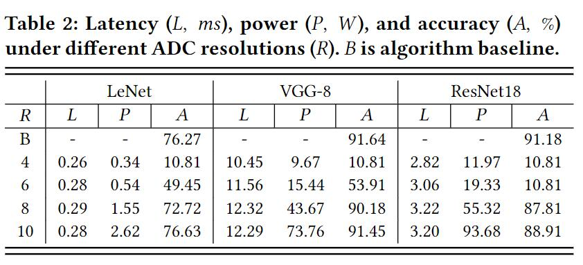

# MNSIM

MNSIM是清华大学开发的基于忆阻器的神经形态计算系统仿真平台，目前已经开发到了2.0版本：《MNSIM 2.0: A Behavior-Level Modeling Tool for Memristor-based Neuromorphic Computing Systems》，并且扩展MNSIM 2.0，以支持PIM架构的硬件性能建模：《MNSIM-TIME: Performance Modeling Framework for Training-In-Memory Architectures》。

### MNSIM 2.0: A Behavior-Level Modeling Tool for Memristor-based Neuromorphic Computing Systems

这篇论文主要是介绍了MNSIM 2.0的总体架构设计，在上层应用层面上CNN模型优化过程和在底层硬件层面上对于性能评估的流程。

1. MNSIM总体架构

    

上图即为MNSIM 2.0的基本架构设计。从系统角度来看，MNSIM的PIM系统由CPU、DRAM和CNN加速器组成。CPU负责控制CNN模型训练时的写入权重，并在测试时启动CNN加速器。DRAM分别在训练阶段和测试阶段存储权重参数和输入数据。当训练模型时，CNN加速器在启动后从DRAM读取输入数据，并在计算期间使用片上缓冲器（图中的各种buffer）存储所有中间数据。CNN加速器完成训练后，结果返回给CPU。(简略的前置知识：深度神经网络包括训练和测试两个过程，训练会改变深度神经网络中的参数，测试得到神经网络的准确率，从而评估神经网络的好坏。)

其中CNN加速器包括多个组(bank)、全局缓冲器(buffer)和全局累加器(accumulator)。全局缓冲器和累加器负责计算网络结构中的元素的和。从高层次到低层次，架构的分层结构包括组(bank)、片(tile)、处理单元（PE,process element）和crossbar阵列(XBAR)。

在每个组(bank)中，以片上网络（NoC）的方式组织和连接片(tile)。不同的组与总线相连，并使用组级输出缓冲器进行数据通信。

每个片(tile)与数据转发单元（Data Forwarding Unit）相邻，该数据转发单元从其他片接收数据，合并（即添加或串联），并将结果输出到最近的片或其他片中。处理单元（PE,process element）的连接结构为H-Tree，“H”结构的每个连接节点都是一个数据转发和合并模块（Joint Module），并且“H”结构可以减少互连开销。

处理单元（PE,process element）主要包含XBAR，DAC（Digital to Analog converter）和ADC（Analog to Digital converter），PE缓冲器以及合并树等 。

2. CNN模型映射与硬件资源分配

    

如图3（a）所示，理想情况下，在PIM的CNN加速器，三维的卷积核被拉长为一维的列向量，并映射到XBAR的一列中。一层中的不同卷积核(由于一张图片的颜色是由RGB三个通道构成，因此图片为三维数据，对应的卷积核也有三个)被放置在同一个XBAR的不同列中。

输入数据映射如图3（b）所示。对应于卷积核的输入数据也被转换为向量。该向量将通过DAC转换为电压脉冲信号，并加载到XBAR上。与卷积核的多个XBAR中的扩展不同，每个滑动窗口中的输入数据需要在不同的计算周期中顺序加载。

3. 数据流结构

    

如前所述，如果神经网络的一个层的大小超过了一个tile可以存储的参数量，则需要多个tile，它们的结果需要在传输到下一层之前合并在一起。tile可配置为两种操作模式，即卷积层和全连接层的矩阵乘法模式和池化层的池化模式，如图4所示。

（1）输入数据流：对于矩阵乘法模式，输入数据流从数据转发单元开始，通过H树到达PE，然后将输入数据写入输入激活缓冲器。对于池化模式，输入数据流绕过H树结构，并直接到池缓冲区（buffer）。

 （2）计算数据流：对于矩阵乘法模式，首先从缓冲区读取输入数据，然后发送到输入寄存器（IREG）。在每个周期中，将几个输入数据加载到DAC，然后在XBAR中完成计算。之后，产生的模拟值由ADC转换为数字形式。临时结果被移位并与上一个计算步骤的结果相加，并存储在输出寄存器中，加法器树合并此PE中所有交叉的结果

（3）输出数据流：输出数据流与输入数据流类似。模块首先合并PE中的结果，然后将合并的PE结果和池化结果发送到输出缓冲区。数据转发单元从输出缓冲区读取数据并将其发送到其他tile。

4. 评估结果

5. MNSIM 2.0 概述

    

MNSIM 2.0 包括CNN模型优化流程，性能建模和评估流程。这两部分形成闭环反馈，即CNN模型优化流程利用建模和评估流程生成的建模结果来指导CNN量化方式，然后将优化的算法参数发送到建模和评估流程，以进一步评估PIM系统的性能。

### MNSIM-TIME: Performance Modeling Framework for Training-In-Memory Architectures

    

对MNSIM 2.0的架构进行改进，rearrangement unit，weight gradient等新增加的部件能够储存神经网络训练过程的中间计算结果，使得能够加快反向传播的计算速度，提高性能。

    

和原来的数据流动相比，增加了储存中间计算结果的数据流。
