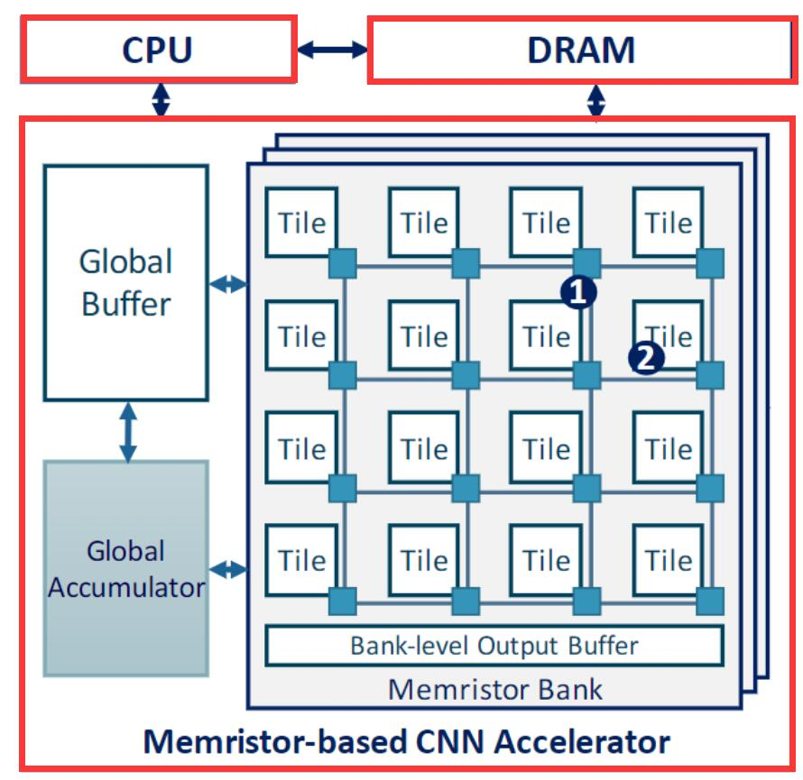
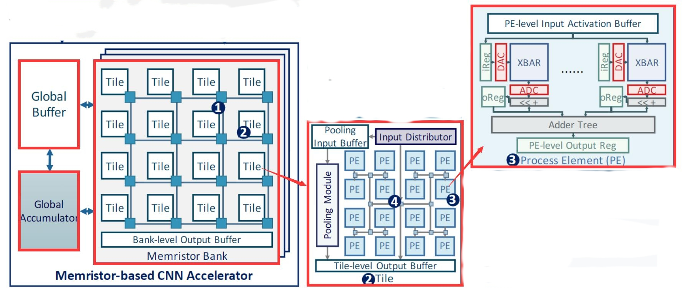
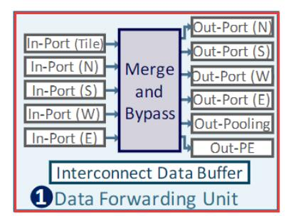
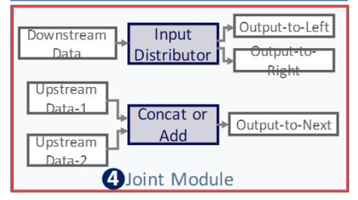

# MNSIM

MNSIM是清华大学开发的基于忆阻器的神经形态计算系统仿真平台，目前已经开发到了2.0版本：《MNSIM 2.0: A Behavior-Level Modeling Tool for Memristor-based Neuromorphic Computing Systems》，并且扩展MNSIM 2.0，以支持PIM架构的硬件性能建模：《MNSIM-TIME: Performance Modeling Framework for Training-In-Memory Architectures》。

##### MNSIM 2.0: A Behavior-Level Modeling Tool for Memristor-based Neuromorphic Computing Systems

这篇论文主要是介绍了MNSIM 2.0的总体架构设计，在上层应用层面上CNN模型优化过程和在底层硬件层面上对于性能评估的流程。

上图即为MNSIM 2.0的基本架构设计。从系统角度来看，MNSIM的PIM系统由CPU、DRAM和CNN加速器组成。CPU负责控制CNN模型训练时的写入权重，并在测试时启动CNN加速器。DRAM分别在训练阶段和测试阶段存储权重参数和输入数据。当训练模型时，CNN加速器在启动后从DRAM读取输入数据，并在计算期间使用片上缓冲器（图中的各种buffer）存储所有中间数据。CNN加速器完成训练后，结果返回给CPU。(简略的前置知识：深度神经网络包括训练和测试两个过程，训练会改变深度神经网络中的参数，测试得到神经网络的准确率，从而评估神经网络的好坏。)

其中CNN加速器包括多个组(bank)、全局缓冲器(buffer)和全局累加器(accumulator)。全局缓冲器和累加器负责计算网络结构中的元素的和。从高层次到低层次，架构的分层结构包括组(bank)、片(tile)、处理单元（PE,process element）和crossbar阵列(XBAR)。

在每个组(bank)中，以片上网络（NoC）的方式组织和连接片(tile)。不同的组与总线相连，并使用组级输出缓冲器进行数据通信。

每个片(tile)与数据转发单元（Data Forwarding Unit）相邻，该数据转发单元从其他片接收数据，合并（即添加或串联），并将结果输出到最近的片或其他片中。处理单元（PE,process element）的连接结构为H-Tree，“H”结构的每个连接节点都是一个数据转发和合并模块（Joint Module），并且“H”结构可以减少互连开销。

处理单元（PE,process element）主要包含XBAR，DAC（Digital to Analog converter）和ADC（Analog to Digital converter），PE缓冲器以及合并树等 。

CNN模型优化流程和。

1.，MNSIM 2.0可以模拟考虑数据分割策略和忆阻非理想因素的混合精度CNN的推理精度。MNSIM 2.0还集成了两种硬件感知CNN优化策略，即PIM头上感知混合精度CNN量化方法和能效非均匀激活量化方法，以优化PIM系统的CNN模型。

2.在硬件层面，我们提出了一种分层建模结构来描述可配置的混合精度CNN计算体系结构。在MNSIM 2.0中，用户可以利用这种分层结构来定制从设备到模块互连的架构设计。此外，MNSIM 2.0提供了一个内层流水线结构，作为评估计算延迟和能耗的默认配置。流水线结构利用CNN数据流特性来提高计算并行性并减少计算延迟。

3.我们提出了一个通用的CNN映射和调度模块，它提供了各种算法模型和架构设计之间的连接和接口。它也有助于探索建筑设计空间。

4.给出了MNSIM 2.0的案例研究，这有助于我们分析在不同硬件配置和CNN模型下精度和硬件性能优势之间的权衡
